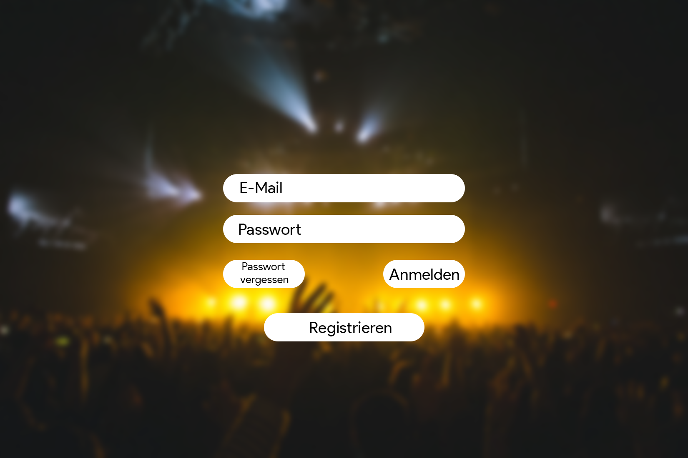

# Report #1 (16.10.2019)

**Gemacht:**
* Einrichten der Entwicklungsumgebung
* Diskussion über Schwächen und Stärken im Team
* Grobe Skizze über das Aussehen der Seite

**Zu tun:**
* Rollenverteilung
* Gemeinsame Einführung zu Angular & Ionic
* Ziele des ersten Meilensteines erarbeiten
